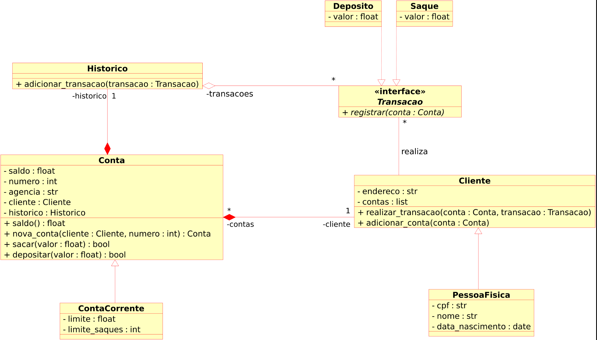

# Modelando um sistema bancário em POO com Python

## Desafio

Implementar um sistema bancário, que armazene dados de clientes e contas bancárias em objetos. O modelo deve seguir o modelo de classes UML a seguir:

Após concluir a modelagem das classes e a criação dos métodos. Atualizar os métodos que tratam as opçẽos de menu, para funcionarem com classes modeladas.